# Hackccelerate


An Online education platfrom for schools 


## Installation
```bat
git clone 
cd 
pip install -r 'requirements.txt'
python manage.py makemigrations
python manage.py migrate

```

- Cache db settings
- memached for cache
In settings.py change the "CHANNEL_LAYERS" configuration to your local redis server

```bat
python manage.py runserver
```

### you can visit the deploy without any cachdb here


## Features 

### Students

Note : Once user register's his accounts ,admin needs to approve the account

- login and register
- enroll courses available
- see all courses 
- navigation to course where they can see different modules,
announcments regarding the course and contents of modules also 
chat with other studets in course chat room
- see the dicussion/posts posted by teachers/students


### Teachers
- login and register
- create a course
- edit /moules
- reorder them on course page
- post course content in text/video/file
- create/view public uploads 


### Parentts
-  login and register
- See announcements regarding their children's courses
- Events 
- Holiays
- see report cards of each child(Attendance is manual,so is the grade )
- create/view public uploads 


## Gallery


### home page
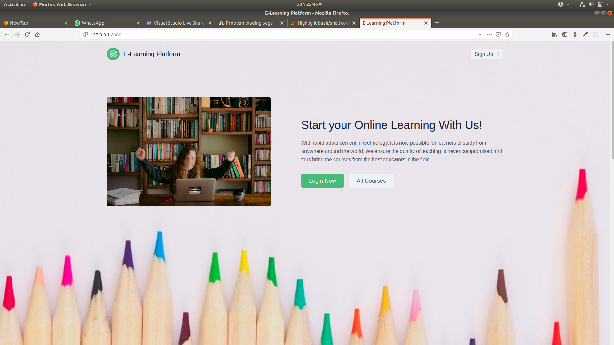
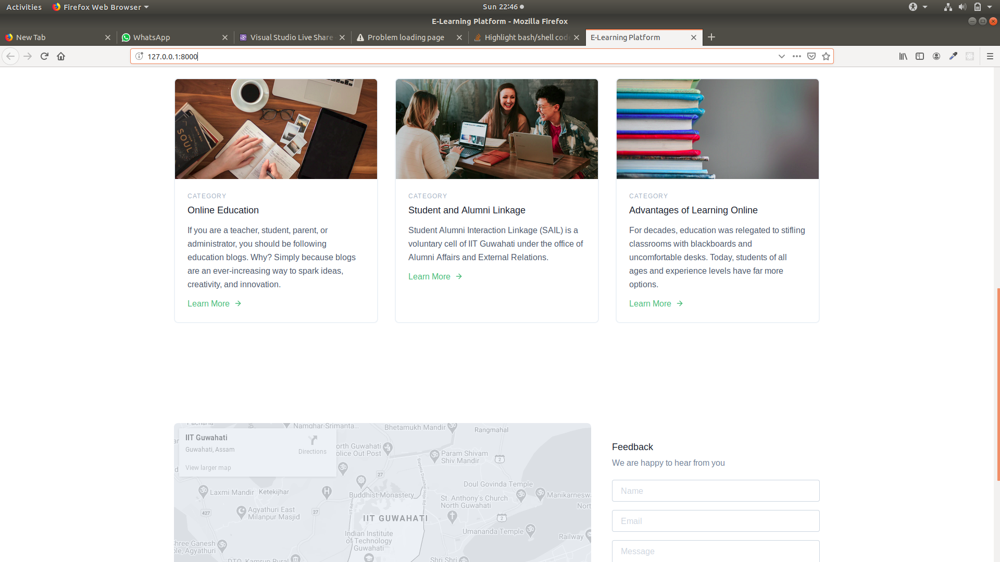

### signin
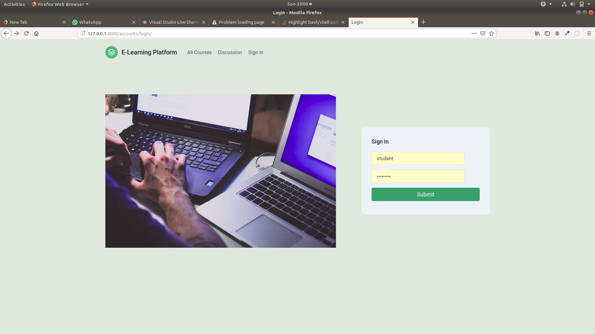

### approval
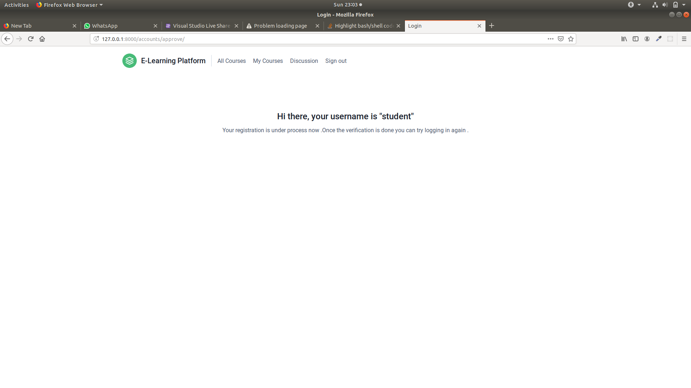

### student
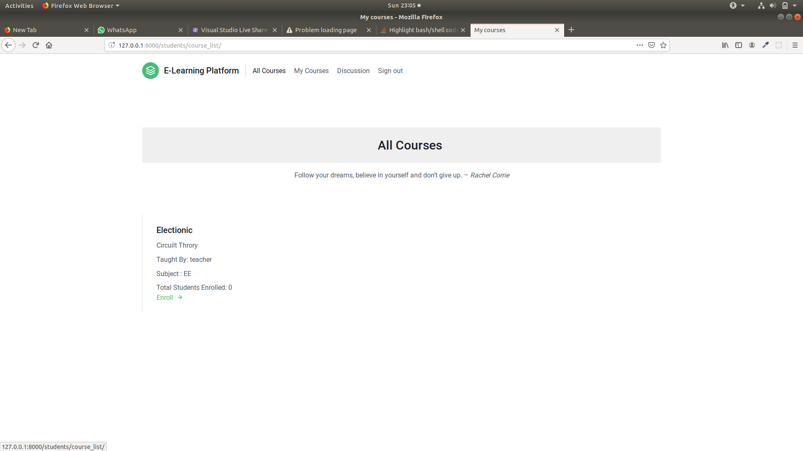
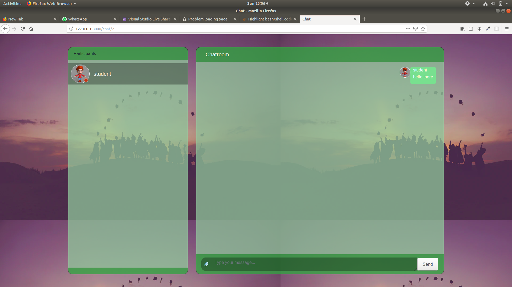
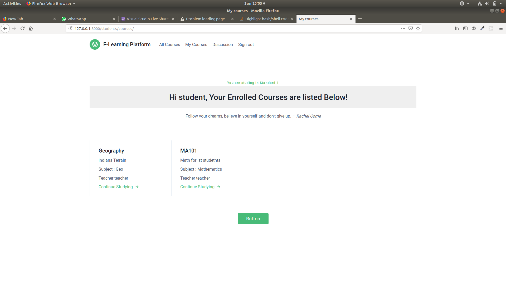
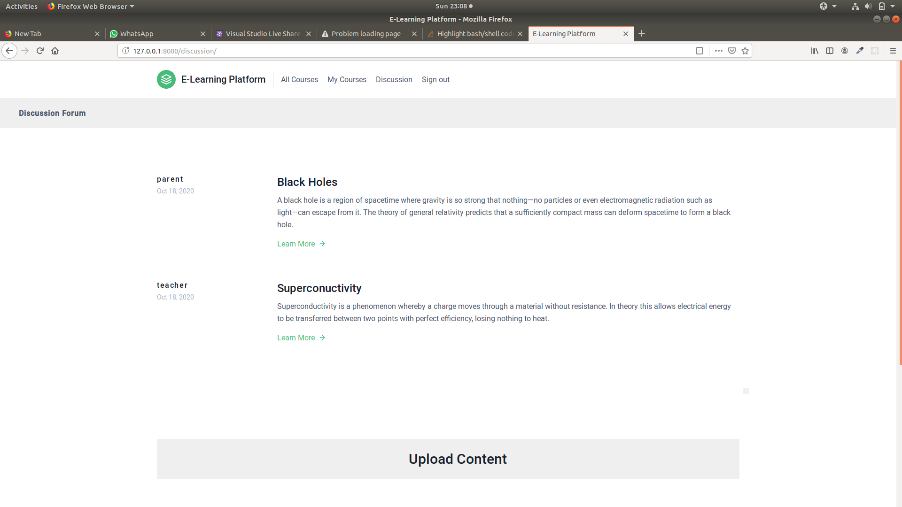


### teacher
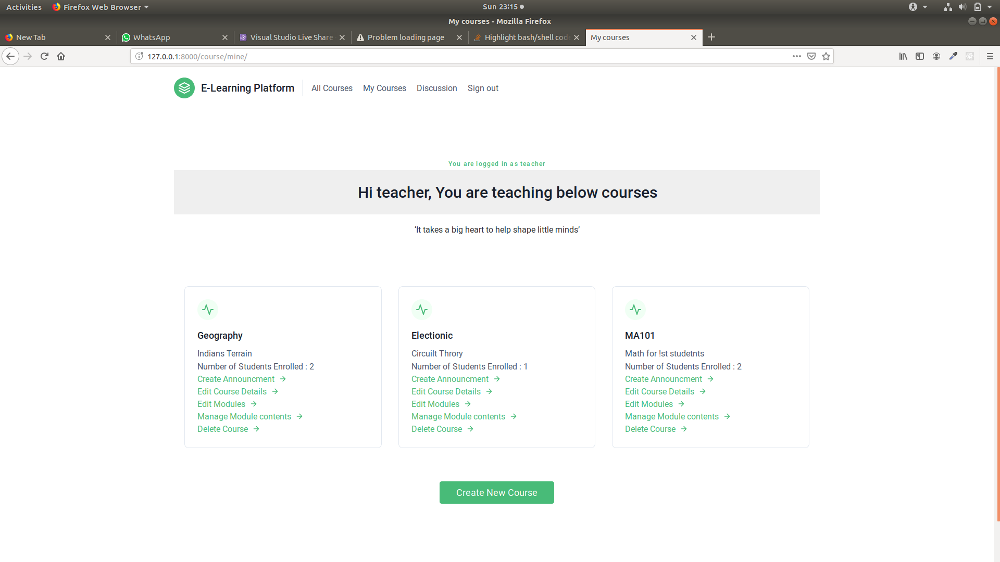
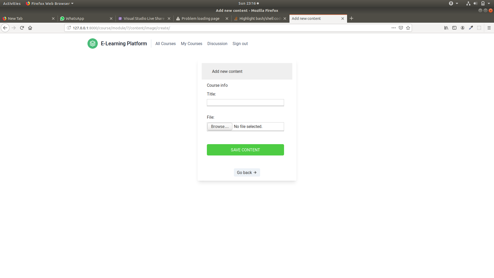


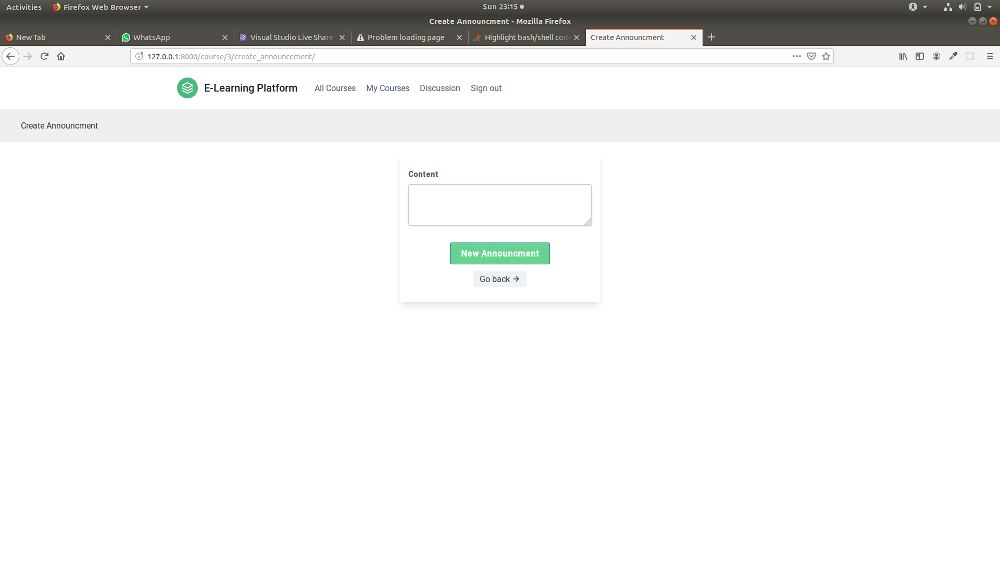


### parent
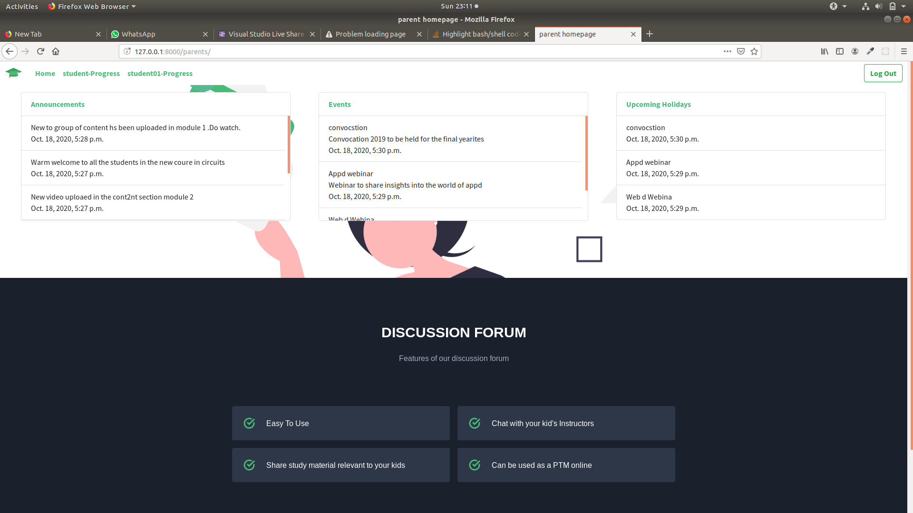
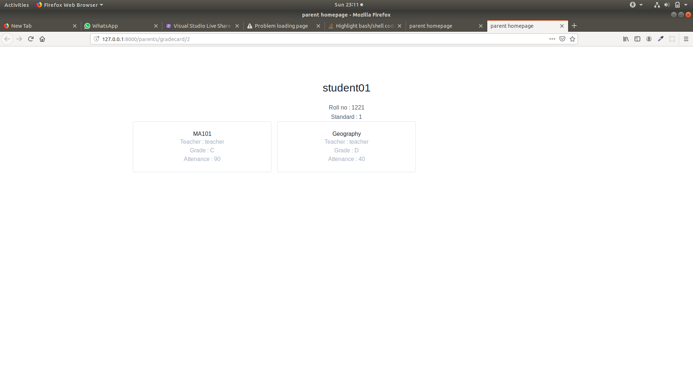